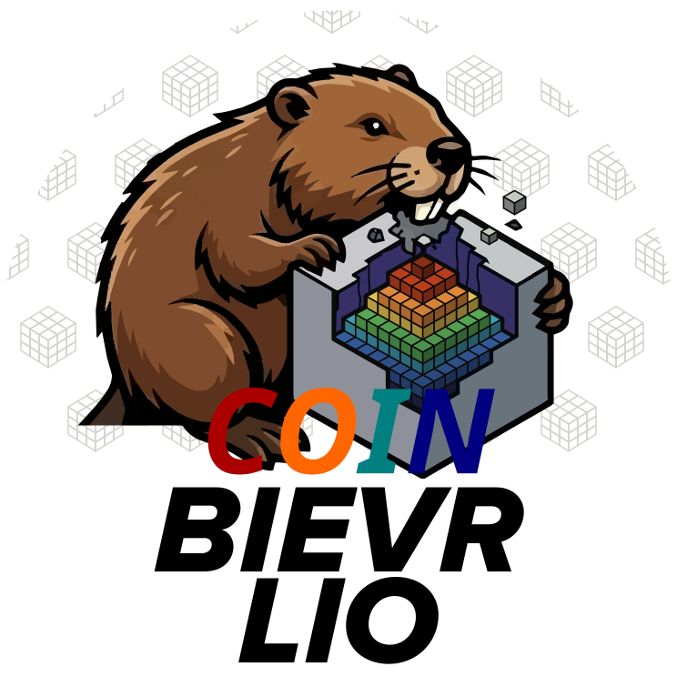

<p align="center">
  
</p>


# COIN-BIEVR: 3D Intensity Mapping for Robust LiDAR-Inertial Odometry

<p align="center">
<a href="https://github.com/Josgonmar/COIN-BIEVR"></a>
<a href="https://icra2026-rigorous-perception.github.io/pdf/pfreundschuh2026.pdf"></a>
<a href="LICENSE"></a>
</p>

<p align="center">
  
</p>

COIN-BIEVR adapts intensity-based concepts from COIN-LIO into the BIEVR-LIO framework by augmenting it with voxel-wise intensity maps. This enables photometric optimization in 3D space, instead of a projected 2D image space, which supports irregular LiDAR scan patterns.

>[!IMPORTANT]
> This is an independent, unofficial implementation of COIN-BIEVR, built mostly for the fun of it and to learn more about the method. I’m not affiliated with the authors of the COIN-BIEVR paper, and this repository should not be considered an official or reference implementation.
>
> The project builds on the authors’ official open-source BIEVR-LIO implementation. I implemented the intensity-related additions myself, following the COIN-BIEVR paper as closely as I could.
>
> I’m by no means an expert on this, so expect rough edges, misunderstandings, and probably a bug or two. AI-assisted tools were also used during implementation and code review, so there may well be some confidently invented nonsense hiding somewhere. If you spot something wrong, corrections and contributions are very welcome!
>
>[!NOTE]
> The implementation currently uses the generic spherical projection from Equation (1) of the paper. I haven’t tested it across many different LiDAR configurations yet, so I’d recommend taking a look at the config files and checking that the assumptions make sense for your setup.

<details>
<summary><b>COIN-BIEVR paper abstract</b></summary>
<br>
Purely geometry-based LiDAR-Inertial Odometry
(LIO) often fails in geometrically degenerate environments, like
tunnels or flat fields. While current intensity-augmented methods mitigate this, they rely on dense intensity images for feature
detection and gradient calculation. This introduces errors from
approximated projection models and is incompatible with the irregular scan patterns of many modern sensors. To address this,
we propose COIN-BIEVR, which integrates intensity directly
into a high-resolution 3D map. Rather than performing 2D
image-feature detection, we propose a map-informed sampling
to identify informative intensity points. These points are used to
extend a geometry-based LIO framework with a photometric
optimization that calculates intensity gradients directly on the
3D representation without an intermediate projection model
and thereby supports diverse scan patterns. Experiments across
multiple datasets demonstrate that COIN-BIEVR significantly
improves robustness in degenerate scenarios while maintaining
or improving accuracy in geometrically rich environments.
</details>

# Setup

The core estimator (`coin_bievr`) is a self-contained, ROS-independent library. On
top of it we provide both a **ROS1** interface (`coin_bievr_ros`) and a **ROS2**
interface (`coin_bievr_ros2`), which live side by side under `interfaces/`.

## Installation

### Dependencies

The core estimator depends on **[Eigen](https://eigen.tuxfamily.org)**,
**[Ceres](http://ceres-solver.org)**, and **[TBB](https://github.com/uxlfoundation/oneTBB)**.
The ROS wrappers additionally use `yaml-cpp` and the dependencies provided by
their respective ROS distributions.


Build instructions for both ROS versions are below. Each also offers an optional
Docker image for quickly trying out the system without setting up dependencies.

<details>
<summary><b>ROS1</b></summary>
<br>

### For quick testing: Docker

If you just want to try the system out without setting up dependencies, build the
image and drop into a shell inside it:

```bash
cd docker/
./run_docker_ros1.sh -b
```

The `-b` flag builds the image. On subsequent runs you can
omit it to reuse the existing image. Your `~/data` folder is mounted to
`/home/coin_bievr/data` inside the container so you can keep datasets outside the
image.

To open another terminal inside the running container (e.g. to launch a node
and play a bag):

```bash
docker exec -it COIN-BIEVR-ROS1 /bin/bash
```

### Build

Requires [ROS Noetic](https://wiki.ros.org/noetic/Installation/Ubuntu) and
the build dependencies used by the packages:

```bash
sudo apt install git build-essential cmake python3-catkin-tools libeigen3-dev \
  libgoogle-glog-dev libtbb-dev libyaml-cpp-dev
```

Create a catkin workspace and clone COIN-BIEVR into it:

```bash
mkdir -p ~/catkin_ws/src
cd ~/catkin_ws
catkin init
catkin config --extend /opt/ros/noetic
catkin config --cmake-args -DCMAKE_BUILD_TYPE=Release
catkin config --merge-devel

cd ~/catkin_ws/src
git clone git@github.com:Josgonmar/COIN-BIEVR.git
```

Install the Ceres version used by COIN-BIEVR with the provided script (builds
Ceres 2.2.0 from source):

```bash
sudo ./COIN-BIEVR/docker/scripts/install_ceres.sh
```

(Optional) **Livox support.** The Livox `CustomMsg` branches are only compiled if
the corresponding driver is found in the workspace at build time. Otherwise
COIN-BIEVR builds fine without them. If you need to process Livox data, clone and
build the matching driver into `~/catkin_ws/src` *before* building COIN-BIEVR
(each driver also needs its Livox-SDK installed system-wide):

- Livox gen1 (`livox_ros_driver`, enables `COIN_BIEVR_WITH_LIVOX`):
  [livox_ros_driver](https://github.com/Livox-SDK/livox_ros_driver) +
  [Livox-SDK](https://github.com/Livox-SDK/Livox-SDK)
- Livox gen2 (`livox_ros_driver2`, enables `COIN_BIEVR_WITH_LIVOX2`):
  [livox_ros_driver2](https://github.com/Livox-SDK/livox_ros_driver2) +
  [Livox-SDK2](https://github.com/Livox-SDK/Livox-SDK2)

Build and source it:

```bash
cd ~/catkin_ws
catkin build coin_bievr_ros
source devel/setup.bash
```
</details>

<details>
<summary><b>ROS2</b></summary>
<br>

### For quick testing: Docker

If you just want to try the system out without setting up dependencies, build the
image and drop into a shell inside it:

```bash
cd docker/
./run_docker_ros2.sh -b
```

The `-b` flag builds the image. On subsequent runs you can
omit it to reuse the existing image. Your `~/data` folder is mounted to
`/home/coin_bievr/data` inside the container.

To open another terminal inside the running container (e.g. to launch a node
and play a bag):

```bash
docker exec -it COIN-BIEVR-ROS2 /bin/bash
```

### Build

Requires [ROS2 Jazzy](https://docs.ros.org/en/jazzy/Installation.html) and
the build dependencies used by the packages:

```bash
sudo apt install git build-essential cmake python3-colcon-common-extensions \
  libeigen3-dev libgoogle-glog-dev libtbb-dev libyaml-cpp-dev
```

These instructions target Jazzy. The repository also contains a separate
ROS2 Humble CI workflow.

Create a colcon workspace and clone COIN-BIEVR into it:

```bash
mkdir -p ~/colcon_ws/src
cd ~/colcon_ws/src
git clone git@github.com:Josgonmar/COIN-BIEVR.git
```

Install the Ceres version used by COIN-BIEVR with the provided script (builds
Ceres 2.2.0 from source):

```bash
sudo ./COIN-BIEVR/docker/scripts/install_ceres.sh
```

(Optional) **Livox support.** The Livox `CustomMsg` branch is only compiled if
`livox_ros_driver2` is found in the workspace at build time. Otherwise COIN-BIEVR
builds fine without it. If you need to process Livox data, clone and build the
driver into `~/colcon_ws/src` *before* building COIN-BIEVR (it also needs its
Livox-SDK2 installed system-wide). Only gen2 exists for ROS2 (enables
`COIN_BIEVR_WITH_LIVOX`):

- [livox_ros_driver2](https://github.com/Livox-SDK/livox_ros_driver2) +
  [Livox-SDK2](https://github.com/Livox-SDK/Livox-SDK2)

Build and source it (from the workspace root, so colcon picks up both `COIN_BIEVR/`,
the core, and `interfaces/ros2`):

```bash
cd ~/colcon_ws
source /opt/ros/jazzy/setup.bash
colcon build --packages-up-to coin_bievr_ros2
source install/setup.bash
```
</details>

## Run data

COIN-BIEVR provides two entry points, available for both ROS versions:

- **`process_topics`** runs online: it subscribes to the LiDAR and IMU topics and
  processes messages as they arrive. Use it with a live sensor or alongside
  `rosbag play`.
- **`process_bag`** reads a recorded bag directly and pushes its messages through
  the pipeline as fast as they can be processed (no real-time playback). This is the preferred choice for offline evaluation and reproducing results.

In the commands below, replace `<sensor_config>` with one of the provided configs
(see [Configuration](#configuration)) or your own. Add `rviz:=true` to bring up
the visualization.

<details>
<summary><b>ROS1</b></summary>
<br>

Process live topics:

```bash
roslaunch coin_bievr_ros process_topics.launch sensor_config:=<sensor_config>
```

Replay a rosbag:

```bash
roslaunch coin_bievr_ros process_bag.launch sensor_config:=<sensor_config> rosbag:=/path/to/bag.bag
```
</details>

<details>
<summary><b>ROS2</b></summary>
<br>

Process live topics:

```bash
ros2 launch coin_bievr_ros2 process_topics.launch.py sensor_config:=<sensor_config>
```

Replay a rosbag2 directory:

```bash
ros2 launch coin_bievr_ros2 process_bag.launch.py sensor_config:=<sensor_config> rosbag:=/path/to/bag_dir
```
</details>

## Configuration

The configuration is split in two files:

- **`config/params.yaml`**: Algorithm parameters (map resolution, sampling,
  optimization, IMU window, ...). These are shared across sensors.
- **`config/sensor_configs/<name>.yaml`**: Per-dataset / per-sensor settings:
  the LiDAR and IMU topic names, the LiDAR→IMU extrinsic calibration, and the
  LiDAR min/max range, spherical intensity-image geometry, brightness window,
  and intensity normalization scale.

Select a sensor config at launch with `sensor_config:=<name>`, which resolves to
`config/sensor_configs/<name>.yaml` (an absolute path starting with `/` is used
verbatim, so configs may also live outside the package). Likewise `params:=<name>`
(default `params`) selects `config/<name>.yaml`.

<details>
<summary><b>Provided datasets</b></summary>
<br>

The repository provides sensor configs for the following public datasets:

| Config | Dataset |
|--------|---------|
| `enwide` | [ENWIDE](https://projects.asl.ethz.ch/datasets/enwide/) |
| `ncd` | [Newer College Dataset](https://drive.google.com/drive/u/0/folders/1uR476FzjN3PfAiCknVKtuZi3_QfVvSdA) |
| `gamma` | [GEODE](https://thisparticle.github.io/geode) |
| `mars` | [MARS-LVIG](https://mars.hku.hk/dataset.html) |
| `grandtour` | [GrandTour](https://grand-tour.leggedrobotics.com/) |
</details>

<details>
<summary><b>Running on your own data</b></summary>
<br>

To run COIN-BIEVR on a new sensor or dataset, copy one of the provided sensor
configs to `config/sensor_configs/<your_name>.yaml` and adjust:

- `topics.pointcloud` / `topics.imu` : The topic names in your data.
- `calibration` : the `T_IMU_LIDAR` extrinsic (LiDAR → IMU) rotation and
  translation for your setup.
- `lidar.min_range_m` / `lidar.max_range_m` : the usable range of your LiDAR.
- `intensity` : the sensor-specific spherical projection dimensions, vertical
  field of view, brightness window, and normalization scale.

For `sensor_msgs/PointCloud2`, the input must contain contiguous `x`, `y`, and
`z` fields, a per-point `t`, `time`, or `timestamp` field, and a numeric
`intensity` or `reflectivity` field. Scans without those required channels are
rejected. Supported Livox custom messages provide time and reflectivity through
their native fields.

The shared algorithm parameters in `params.yaml` are intended to remain the
same between sensor configurations; tune them only when needed for your setup.
</details>

# Acknowledgements

This repository is built on the official
[BIEVR-LIO](https://github.com/ethz-asl/BIEVR-LIO) implementation. I sincerely
thank its authors for publishing their code and making this independent
COIN-BIEVR implementation possible. The intensity-related extensions in this
repository were developed by following the COIN-BIEVR paper; the original
BIEVR-LIO and COIN-BIEVR authors are not responsible for this implementation.

The upstream BIEVR-LIO project also acknowledges
[DLIO](https://github.com/vectr-ucla/direct_lidar_inertial_odometry),
[Wavemap](https://github.com/ethz-asl/wavemap), and
[UGPM](https://github.com/UTS-RI/ugpm). The ASCII art was generated using
[ascii-image-converter](https://github.com/TheZoraiz/ascii-image-converter).

For a full SLAM integration including loop-closure detection and pose-graph
optimization, see
[BIEVR-LIO-SLAM](https://github.com/S0UL4/BIEVR-LIO-SLAM), contributed by
[SOUL4](https://github.com/S0UL4).

# License and disclaimer

This repository is distributed under the same
[BSD 3-Clause License](LICENSE) as the original BIEVR-LIO codebase. The software
is provided **as is**, without warranties or guarantees of correctness,
fitness, safety, or suitability for any purpose. Use, modification, and
deployment are at your own risk. Neither the repository maintainer nor the
upstream authors accept liability for damages or losses arising from its use.
The complete license text governs if this summary conflicts with it.

# Citation

If you use this repository in your research, please cite both the original
BIEVR-LIO work and the COIN-BIEVR paper followed by this implementation.

```bibtex
@article{pfreundschuh2026bievr,
  title        = {BIEVR-LIO: Robust LiDAR-Inertial Odometry through Bump-Image-Enhanced Voxel Maps},
  author       = {Pfreundschuh, Patrick and Tuna, Turcan and {Le Gentil}, Cedric and Siegwart, Roland and Cadena, Cesar and Oleynikova, Helen},
  year         = 2026,
  journal      = {Robotics: Science and Systems},
}
```

```bibtex
@article{pfreundschuh2026coinbievr,
  title        = {COIN-BIEVR: 3D Intensity Mapping for Robust LiDAR-Inertial Odometry},
  author       = {Pfreundschuh, Patrick and {Le Gentil}, Cedric and Siegwart, Roland and Cadena, Cesar},
  year         = 2026,
  url          = {https://icra2026-rigorous-perception.github.io/pdf/pfreundschuh2026.pdf},
}
```
